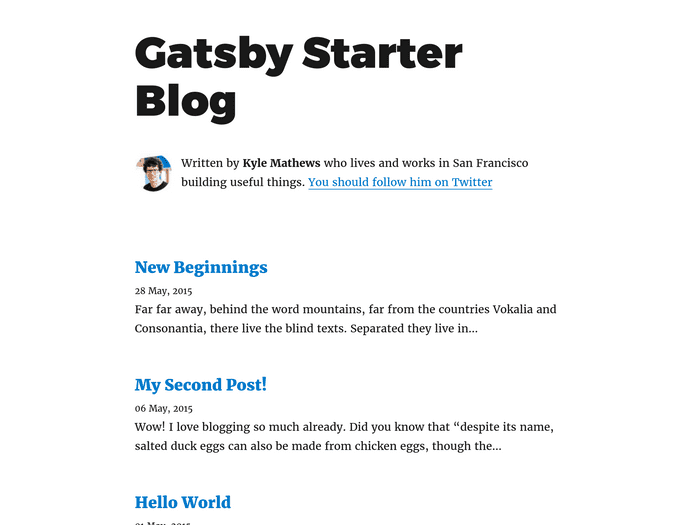
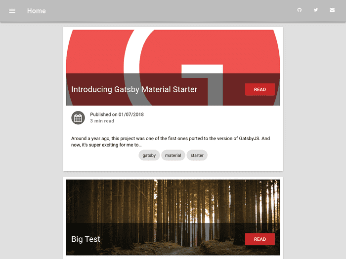
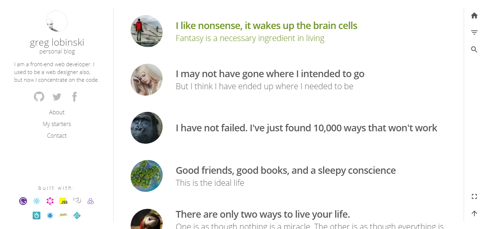

**M0Nk3y WebDev** started off as a [GatsbyJS](https://www.gatsbyjs.org/) starter that I ended up modiying to better suite my style and needs. Here's a couple examples of [Gatsby.js starters](https://www.gatsbyjs.org/starters/?v=2):

### gatsby-starter-blog

Bare bones, official starter blog. Not a lot of :bell:'s and whistles, but a great introduction and **blank canvas**.
[Demo](https://gatsby-starter-default-demo.netlify.com/) | [Github repo](https://github.com/gatsbyjs/gatsby-starter-default)

### gatsby-material-starter

Nice looking starter, uses Material styling. Some nice features such as SASS, Google Analytics, SEO, etc.
[Demo](https://vagr9k.github.io/gatsby-material-starter/) | [Github repo](https://github.com/Vagr9K/gatsby-material-starter)

### PersonalBlog

A ready to use, easy to customize Gatsby starter with 'like app' layout transitions. [Demo](https://gatsby-starter-personal-blog.greglobinski.com/) | [Github repo](https://github.com/greglobinski/gatsby-starter-personal-blog)

### SimpleLanding

As the name says, it is a simple landing page starter.
[Demo](https://gatsby-starter-simple-landing.greglobinski.com/) | [Github repo](https://github.com/greglobinski/gatsby-starter-simple-landing)
