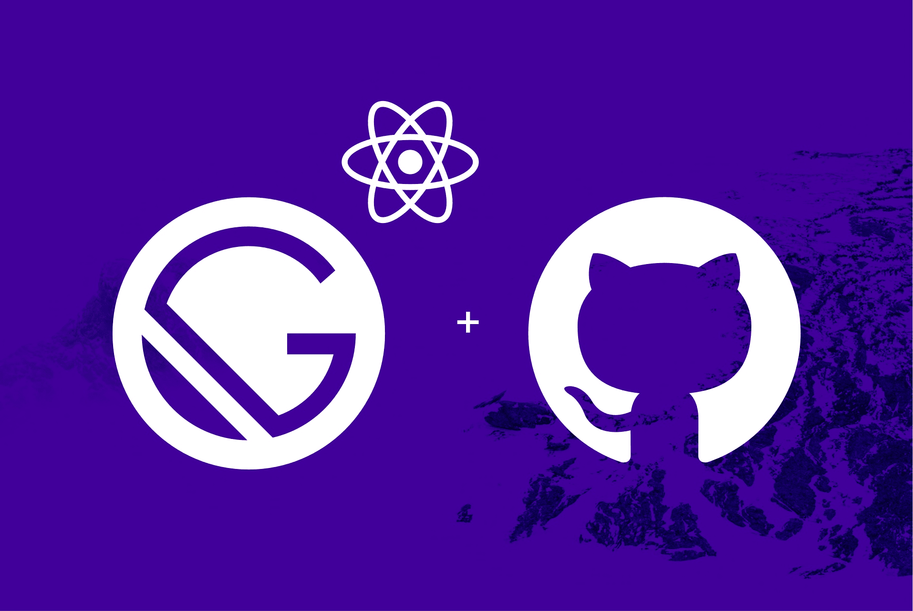

Welcome to my first blog post ✨!! After reading tons of cool blogs by other developers, and gaining lots of practical knowledge, I decided to create one, as well. I hope you learn something that'll help you create your own web app, and enjoy reading my posts as I did writing them!

Today, I'm gonna show you the steps I took to create this site. After trying different frameworks such as, [Jekyll](https://jekyllrb.com) 😉, [WordPress](https://wordpress.org/) 😉, and others, I landed on [Gatsby.js](https://www.gatsbyjs.org/). Although those former frameworks worked well and provided the necessary tools to create a nice blog, after working with [React.js](https://reactjs.org/), [Redux.js](https://redux.js.org/), and [Vue.js](https://vuejs.org/), I wanted a component based framework. [Gatsby's](https://www.gatsbyjs.org/) true strength lies in it's component based architect, while mainting static site builds, hence compatability with [Github Pages](https://pages.github.com/ "Github Pages Homepage")😼 , and other free static site web hosts. Another awesome benefit with [Gastsby](https://www.gatsbyjs.org/) is the ability to use [GraphQL](https://graphql.org), making it both flexible and capable.

## Installing gatsby-cli

1.  First we use [NPM](https://www.npmjs.com) or [Yarn](https://yarnpkg.com/en/) to install [gatsby-cli](https://www.gatsbyjs.org/docs/gatsby-cli/) **globally**.

> As an alternative, you can use [NPX](https://www.npmjs.com/package/npx) to install [Gatsby-cli](https://www.gatsbyjs.org/docs/gatsby-cli/), which downloads the tool temporarily, executes the commands and then deletes it from the disk. Pretty neat addition to [NPM](https://www.npmjs.com).

#### NPM:

```sh
npm install --global gatsby-cli
```

#### NPX:

```sh
npx gatsby-cli new gatsby-site
```

#### Yarn:

```sh
yarn add gatsby-cli --global
```

1. Now we use gatsby-cli to create a new project. We need a dir to build our projects. It's up to you where ever that is, I made mine ~/gatsby . After moving into our new dir we call up gatsby to create a new project. First we'll make their sample one, to see how to structure our site folders, etc.


```sh
mkdir ~/gatsby
cd ~/gatsby
gatsby new gatsby-site
cd gatsby-site
ls -lta
```

2. Now we can use gatsby to serve our site _locally_ and any changes me make to the files will be _**hot-loaded** automatically_ to our browser. Our site will be available at **_http://localhost:8000_**.

```sh
gatsby develop
```

3. The main config is `gatsby-config.js`, located inside the root directory. Here's what mine looks like:

```js:title=gatsby-config.js
require("dotenv").config();
const config = require("./content/meta/config");
const transformer = require("./src/utils/algolia");

const query = `{
  allMarkdownRemark( filter: { fields: { slug: { ne: null } } }) {
    edges {
      node {
        objectID: fileAbsolutePath
        fields {
          slug
        }
        internal {
          content
        }
        frontmatter {
          title
        }
      }
    }
  }
}`;

const queries = [
  {
    query,
    transformer: ({ data }) => {
      return data.allMarkdownRemark.edges.reduce(transformer, []);
    }
  }
];

module.exports = {
  // pathPrefix: config.pathPrefix,
  siteMetadata: {
    title: config.siteTitle,
    description: config.siteDescription,
    siteUrl: config.siteUrl,
    canonicalUrl: "https://toddmath.com",
    image: "https://toddmath.com/preview.jpg",
    author: {
      name: "Todd Matheson"
    },
    organization: {
      name: "Todd Matheson",
      url: "https://toddmath.com",
      logo: "https://toddmath.com/icons/icon-512x512.png"
    },
    social: {
      twitter: "@tM0Nk3y",
      fbAppID: process.env.FB_APP_ID ? process.env.FB_APP_ID : ""
    },
    twitterUsername: config.authorTwitterAccount,
    algolia: {
      appId: process.env.ALGOLIA_APP_ID ? process.env.ALGOLIA_APP_ID : "",
      searchOnlyApiKey: process.env.ALGOLIA_SEARCH_ONLY_API_KEY
        ? process.env.ALGOLIA_SEARCH_ONLY_API_KEY
        : "",
      indexName: process.env.ALGOLIA_INDEX_NAME ? process.env.ALGOLIA_INDEX_NAME : ""
    },
    facebook: {
      appId: process.env.FB_APP_ID ? process.env.FB_APP_ID : ""
    }
  },
  plugins: [
    `gatsby-plugin-styled-jsx`, // the plugin's code is inserted directly to gatsby-node.js and gatsby-ssr.js files
    `gatsby-plugin-styled-jsx-postcss`, // as above
    {
      resolve: `gatsby-plugin-layout`,
      options: {
        component: require.resolve(`./src/layouts/`)
      }
    },
    {
      resolve: `gatsby-plugin-algolia`,
      options: {
        appId: process.env.ALGOLIA_APP_ID ? process.env.ALGOLIA_APP_ID : "",
        apiKey: process.env.ALGOLIA_ADMIN_API_KEY ? process.env.ALGOLIA_ADMIN_API_KEY : "",
        indexName: process.env.ALGOLIA_INDEX_NAME ? process.env.ALGOLIA_INDEX_NAME : "",
        queries,
        chunkSize: 10000 // default: 1000
      }
    },
    {
      resolve: `gatsby-source-filesystem`,
      options: {
        name: `images`,
        path: `${__dirname}/src/images/`
      }
    },
    {
      resolve: `gatsby-source-filesystem`,
      options: {
        path: `${__dirname}/content/posts/`,
        name: "posts"
      }
    },
    {
      resolve: `gatsby-source-filesystem`,
      options: {
        path: `${__dirname}/content/pages/`,
        name: "pages"
      }
    },
    {
      resolve: `gatsby-source-filesystem`,
      options: {
        name: `parts`,
        path: `${__dirname}/content/parts/`
      }
    },
    `gatsby-plugin-sharp`,
    {
      resolve: `gatsby-transformer-remark`,
      options: {
        plugins: [
          {
            resolve: `gatsby-remark-images`,
            options: {
              maxWidth: 800,
              backgroundColor: "transparent",
              wrapperStyle: "margin-bottom:10px; margin-color:#255DC6;",
              quality: "50",
              withWebp: "true"
            }
          },
          {
            resolve: `gatsby-remark-responsive-iframe`,
            options: {
              wrapperStyle: `margin-bottom: 2em`
            }
          },
          {
            resolve: `gatsby-remark-prismjs`,
            options: {
              inlineCodeMarker: ">",
              aliases: {
                sh: "bash",
                js: "javascript"
              }
            }
          },
          `gatsby-remark-copy-linked-files`,
          {
            resolve: `gatsby-remark-smartypants`,
            options: {
              quotes: true,
              ellipses: true,
              backticks: true,
              dashes: "oldschool"
            }
          },
          {
            resolve: "gatsby-remark-emojis",
            options: {
              // Deactivate the plugin globally (default: true)
              active: true,
              // Add a custom css class
              class: "emoji-icon",
              // Select the size (available size: 16, 24, 32, 64)
              size: 64,
              // Add custom styles
              styles: {
                display: "inline",
                margin: "0",
                "margin-top": "1px",
                position: "relative",
                top: "5px",
                width: "25px"
              }
            }
          }
        ]
      }
    },
    {
      resolve: `gatsby-plugin-nprogress`,
      options: {
        // Setting a color is optional.
        color: "#255DC6",
        // Disable the loading spinner.
        showSpinner: true
      }
    },
    `gatsby-plugin-sharp`,
    `gatsby-transformer-sharp`,
    `gatsby-plugin-react-helmet`,
    `gatsby-plugin-catch-links`,
    {
      resolve: `gatsby-plugin-manifest`,
      options: {
        name: config.manifestName,
        short_name: config.manifestShortName,
        start_url: config.manifestStartUrl,
        background_color: config.manifestBackgroundColor,
        theme_color: config.manifestThemeColor,
        display: config.manifestDisplay,
        icons: [
          {
            src: "/icons/icon-48x48.png",
            sizes: "48x48",
            type: "image/png"
          },
          {
            src: "/icons/icon-96x96.png",
            sizes: "96x96",
            type: "image/png"
          },
          {
            src: "/icons/icon-144x144.png",
            sizes: "144x144",
            type: "image/png"
          },
          {
            src: "/icons/icon-192x192.png",
            sizes: "192x192",
            type: "image/png"
          },
          {
            src: "/icons/icon-256x256.png",
            sizes: "256x256",
            type: "image/png"
          },
          {
            src: "/icons/icon-384x384.png",
            sizes: "384x384",
            type: "image/png"
          },
          {
            src: "/icons/icon-512x512.png",
            sizes: "512x512",
            type: "image/png"
          }
        ]
      }
    },
    {
      resolve: `gatsby-plugin-favicon`,
      options: {
        logo: "./src/favicon.png",
        // WebApp Manifest Configuration
        appName: config.manifestName, // Inferred with your package.json
        appDescription: config.siteDescription,
        developerName: config.authorName,
        developerURL: null,
        dir: "auto",
        lang: "en-US",
        background: config.manifestBackgroundColor,
        theme_color: config.manifestThemeColor,
        display: config.manifestDisplay,
        orientation: "any",
        start_url: config.manifestStartUrl,
        version: "1.0",
        icons: {
          android: true,
          appleIcon: true,
          appleStartup: true,
          coast: false,
          favicons: true,
          firefox: true,
          opengraph: true,
          twitter: true,
          yandex: false,
          windows: true
        }
      }
    },
    {
      resolve: `gatsby-plugin-web-font-loader`,
      options: {
        google: {
          families: ["Exo", "Acme"]
        }
      }
    },
    `gatsby-plugin-offline`,
    {
      resolve: `gatsby-plugin-google-analytics`,
      options: {
        trackingId: process.env.GOOGLE_ANALYTICS_ID
      }
    },
    {
      resolve: `gatsby-plugin-feed`,
      options: {
        query: `
          {
            site {
              siteMetadata {
                title
                description
                siteUrl
                site_url: siteUrl
              }
            }
          }
        `,
        feeds: [
          {
            serialize: ({ query: { site, allMarkdownRemark } }) => {
              return allMarkdownRemark.edges.map(edge => {
                return Object.assign({}, edge.node.frontmatter, {
                  description: edge.node.excerpt,
                  url: site.siteMetadata.siteUrl + edge.node.fields.slug,
                  guid: site.siteMetadata.siteUrl + edge.node.fields.slug,
                  custom_elements: [{ "content:encoded": edge.node.html }]
                });
              });
            },
            query: `
              {
                allMarkdownRemark(
                  limit: 1000,
                  sort: { order: DESC, fields: [fields___prefix] },
                  filter: { fields: { slug: { ne: null } } }
                ) {
                  edges {
                    node {
                      excerpt
                      html
                      fields {
                        slug
                        prefix
                      }
                      frontmatter {
                        title
                      }
                    }
                  }
                }
              }
            `,
            output: "/rss.xml"
          }
        ]
      }
    },
    {
      resolve: `gatsby-plugin-sitemap`
    },
    {
      resolve: "gatsby-plugin-react-svg",
      options: {
        include: /svg-icons/
      }
    },
    {
      resolve: "gatsby-plugin-netlify",
      options: {
        allPageHeaders: [
          "Link: </static/icons/icon-48x48.png; rel=preload; as=image",
          "Link: </images/app-icons/icon.png; rel=preload; as=image",
          "Link: </images/jpg/avatar.jpg; rel=preload; as=image"
        ]
      }
    }
  ]
};
```

> As you can see this file gets rather long if you use some of the fantastic [Gastsby plugins](https://www.gatsbyjs.org/docs/plugins/) available. To keep my api keys and other private info out of my git repo, I've created a separate `.env` file. After adding it to `.gitignore`, I export the variables to Netlify.
